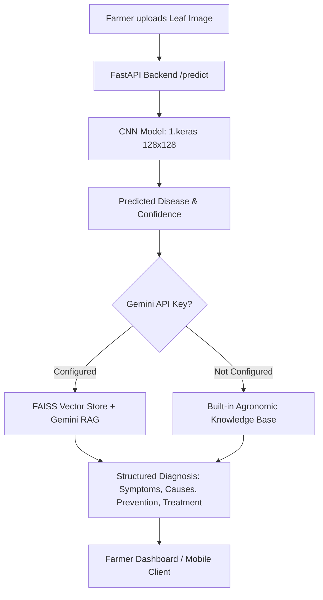

# 🌿 Crop Doctor – AI Based Plant Disease Detection & Advisory System

[](https://www.python.org/)
[](https://fastapi.tiangolo.com/)
[](https://tensorflow.org/)
[](https://keras.io/)
[](LICENSE)

## 📌 Project Overview

**Crop Doctor** is an Artificial Intelligence powered application that detects plant and crop diseases from leaf images and delivers actionable treatment recommendations. The system integrates a Convolutional Neural Network (CNN) trained on over 15,000 leaf images across 41 crop conditions with a chatbot knowledge retrieval system (RAG) to provide farmers, gardeners, and agriculture students with instant diagnosis, causes, prevention methods, and remedies.

---

## 🎯 Objectives

* **Automated Disease Detection**: Instantly classify crop diseases from leaf images.
* **Agronomic Treatment Suggestions**: Deliver structured, practical remedies (both chemical and organic).
* **Preventive Care Advisory**: Provide early preventive guidelines to prevent crop loss.
* **Farmer & Student Support**: Easy-to-use API and interactive dashboard for real-time field assistance.

---

## 🧠 Technologies Used

* **Deep Learning**: TensorFlow & Keras (CNN image classification)
* **Backend API**: FastAPI & Uvicorn
* **Knowledge Retrieval**: FAISS & LangChain
* **LLM Advisory**: Google Gemini API (with offline agronomy knowledge base fallback)
* **Image Processing**: Pillow & NumPy
* **Interactive Dashboard**: Modern responsive HTML5/CSS3 glassmorphism web interface

---

## 📂 System Components

1. **CNN Model (`1.keras`)** – Classifies crop leaf images into 41 distinct health and disease categories across cotton, rice, wheat, maize, and sugarcane.
2. **Knowledge Base (`KnowledgeBase/`)** – Pre-indexed plant pathology information and remedies.
3. **FAISS Index** – Vector similarity search for fast, relevant agricultural guidance.
4. **Crop Doctor Chatbot & API** – Multi-modal advisory delivering disease details, causes, symptoms, and treatments.
5. **Web UI** – Built-in test interface on `http://localhost:9087/` for instant leaf drag-and-drop analysis.

---

## 🌾 Supported Crops & Diseases (41 Classes)

* **Cotton**: American Bollworm, Anthracnose, Cotton Aphid, Healthy Cotton, Leaf Curl, Bacterial Blight, Bollworm, Mealy Bug, Whitefly, Pink Bollworm, Red Cotton Bug, Thrips, Wilt.
* **Rice**: Bacterial Blight, Brownspot, Rice Blast, Tungro.
* **Wheat**: Flag Smut, Healthy Wheat, Leaf Smut, Brown Leaf Rust, Stem Fly, Wheat Aphid, Black Rust, Leaf Blight, Wheat Mite, Powdery Mildew, Scab, Yellow Rust.
* **Maize**: Common Rust, Gray Leaf Spot, Healthy Maize, Ear Rot, Fall Armyworm, Stem Borer.
* **Sugarcane**: Mosaic, Red Rot, Red Rust, Healthy Sugarcane, Yellow Rust.

---

## ⚙️ System Workflow



---

## 📁 Project Structure

```
Crop_doctor/
├── 1.keras                           # Trained CNN classification model (41 classes)
├── KnowledgeBase/                     # Vector store and plant pathology documents
│   └── faiss_index/                  # Pre-built FAISS index files (index.faiss, index.pkl)
├── plantchatbot.py                   # FastAPI application & Crop Doctor advisory server
├── build_faiss_index.py              # Script to build vector index from PDF documents
├── requirements.txt                  # Python dependencies
├── .env.example                      # Template for configuration and API keys
├── ModelTraining.ipynb               # Model training & architecture notebook
├── modeltrain2.ipynb                 # Experimental notebook
├── train.ipynb                       # Training workflow notebook
├── training_history_20251023_212304.csv  # Loss and accuracy logs
├── training_plot_20251023_212304.png    # Training & validation accuracy curves
└── README.md                         # Documentation
```

---

## 🚀 How to Run the Project

### 1. Clone the Repository

```bash
git clone https://github.com/MGanesh09/Crop_doctor.git
cd Crop_doctor
```

### 2. Set Up Virtual Environment (Recommended)

```bash
python -m venv venv

# On Windows:
venv\Scripts\activate

# On Linux/macOS:
source venv/bin/activate
```

### 3. Install Dependencies

```bash
pip install -r requirements.txt
```

### 4. Configure Environment Variables (Optional)

Copy `.env.example` to `.env`:

```bash
cp .env.example .env
```

Add your Google Gemini API key if you want generative AI responses (the server also has built-in offline agronomy knowledge for all 41 diseases):

```env
GOOGLE_API_KEY=your_gemini_api_key_here
LLM_MODEL=gemini-1.5-flash
PORT=9087
HOST=127.0.0.1
```

### 5. Start the Server

```bash
python plantchatbot.py
```

The server will start at:
* **Interactive Web Dashboard**: [http://localhost:9087/](http://localhost:9087/)
* **Interactive Swagger API Docs**: [http://localhost:9087/docs](http://localhost:9087/docs)
* **Health Check**: [http://localhost:9087/health](http://localhost:9087/health)

---

## 📡 API Endpoints

| Method | Endpoint | Description |
|---|---|---|
| `GET` | `/` | Web dashboard (browser) or service status (JSON) |
| `GET` | `/health` | Server and model health check |
| `POST` | `/predict` | Upload image file (`multipart/form-data`) → Returns class & confidence |
| `POST` | `/analyze_disease_from_image` | Upload image → Returns class, confidence & complete diagnosis |
| `POST` | `/chatbot_disease_info` | JSON payload `{"disease_name": "..."}` → Returns structured treatment guide |

---

## 👨‍💻 Maintainer & Author

**MGanesh09**  
* GitHub: [@MGanesh09](https://github.com/MGanesh09)  
* Repository: [https://github.com/MGanesh09/Crop_doctor](https://github.com/MGanesh09/Crop_doctor)

---

## ⭐ License

This project is licensed under the MIT License.
